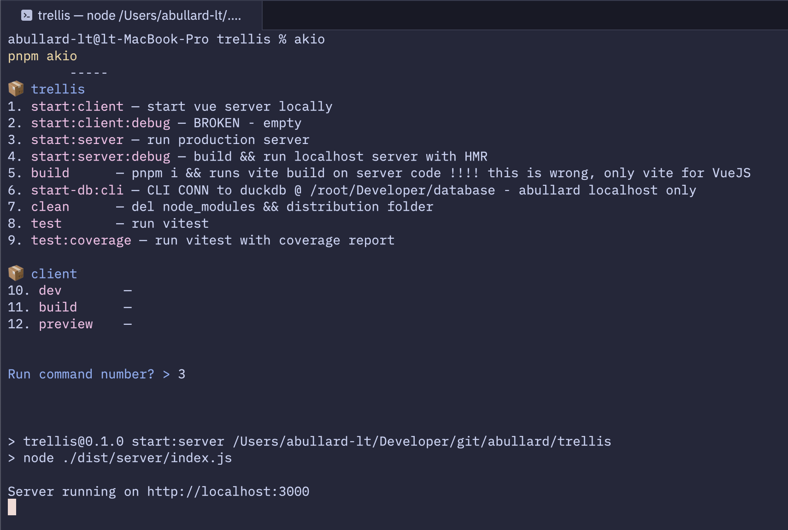

# Akio

**Search, understand, and run your project scripts — fast.**

Your `package.json` is full of mystery meat scripts. `dev:db:reset`? `build:analyze`? Larger teams often have newer devs that don't know what they do.

Akio surfaces your scripts and their descriptions in a clean, numbered list — right in your terminal.



## 🧭 Why Akio?

You’ve asked:

* *What does this script actually do?*
* *Is it safe to run?*
* *Did I write this or inherit it?*

Akio gives you answers — without running anything, guessing, or being clever.
Just a fast, helpful index of your scripts.

## 🚀 Install

```bash
npm install -g akio
# or use it directly
npx akio
```

## 📖 Usage

In any Node.js project with a `package.json`:

```bash
# turn formatting off with -f to make this look like the below output
npx akio -f
```

You’ll see:

```
pnpm akio
	-----
@abullard/akio
1. test       — run vitest unit tests
2. test:stub  — DO NOT REMOVE - stubbed npm script for snapshot tests
3. build      — This command builds Akio

api
4. api:test:stubOne — DO NOT REMOVE - stubbed npm script for monorepo testing
5. api:test:stubTwo — DO NOT REMOVE - stubbed npm script for monorepo testing

ui
6. ui:test:stubOne — DO NOT REMOVE - stubbed npm script for monorepo testing
7. ui:test:stubTwo — DO NOT REMOVE - stubbed npm script for monorepo testing

Run command number? >
```

Hit a number to run that script. Or just use it as a reference.

## 🔍 Search Without Flags

Akio treats the first unnamed CLI argument as a search term:

```bash
npx akio build
```

## ⚙️ CLI Options

* `-i`, `--no-input`: Don’t prompt — just show results
* `-f`, `--no-formatting`: Strip colors (and soon, emojis)
* `-d`, `--no-descriptions`: Don’t warn about missing script docs

Example in `package.json`:

```json
"scripts": {
  "akio": "npx akio -f -i -d dev"
}
```

I recommend an alias with opts if you need them. Example in a `.zshrc` or a `.bashrc`:
```bash
alias akio="npx @abullard/akio -i" # never prompt for input
alias akio="npx @abullard/akio -d" # never warn about missing scriptDescriptions
alias akio="npx @abullard/akio -f" # never show colors (soon emojis)
```

## 📝 Documenting Scripts

Add a `scriptDescriptions` section to your `package.json`:

```jsonc
{
  "scripts": {
    "dev": "vite",
    "build": "vite build"
  },
  "scriptDescriptions": {
    "dev": "Starts the dev server",
    "build": "Builds the project for production"
  }
}
```

No more guessing what `start:proxy` does.

## 🧠 Best Used For

* Dev teams with lots of internal scripts
* Open source projects that skimp on docs
* Onboarding new teammates
* Old projects you forgot how to run

## 🛣️ On the Roadmap

* Paginate Monorepo output
* CI/CD and README badges
* Optional auto-publish to NPM
* JSONC-style inline comments
* Emoji toggle with `--no-formatting`

## 🪪 License

MIT
